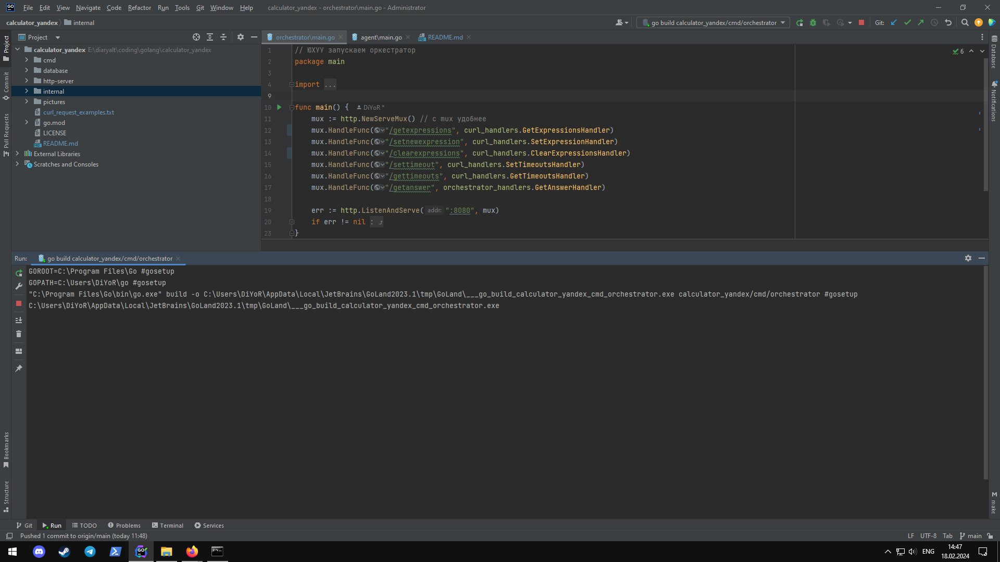
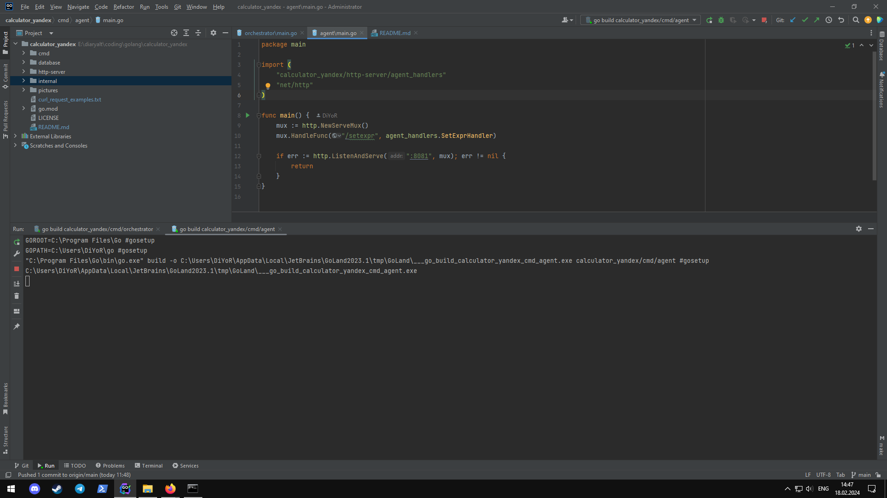
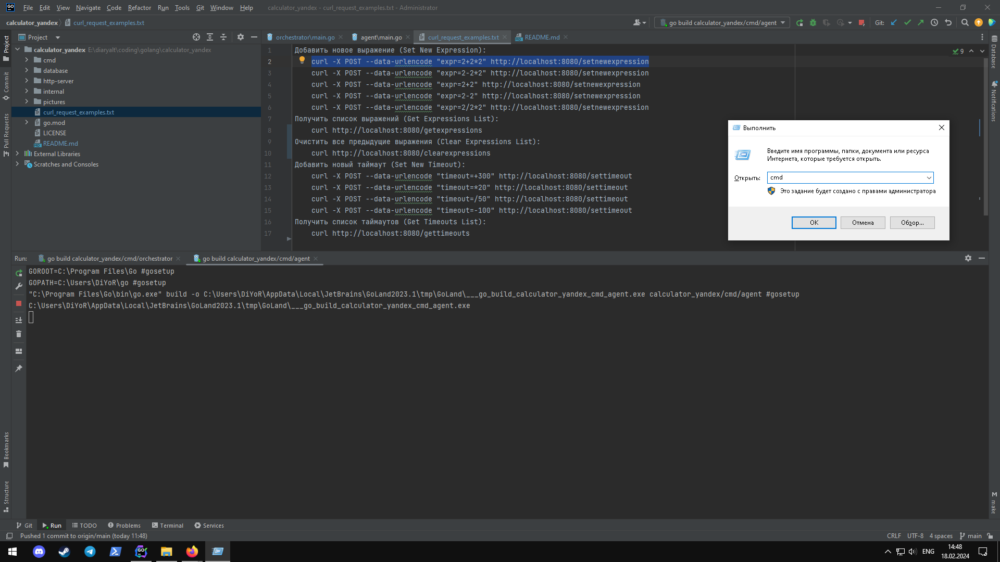
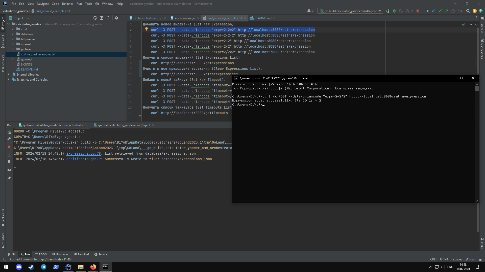
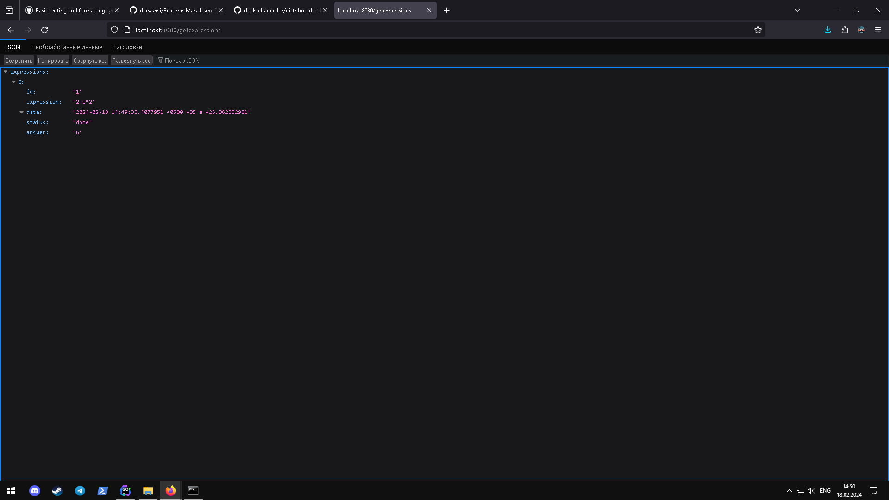
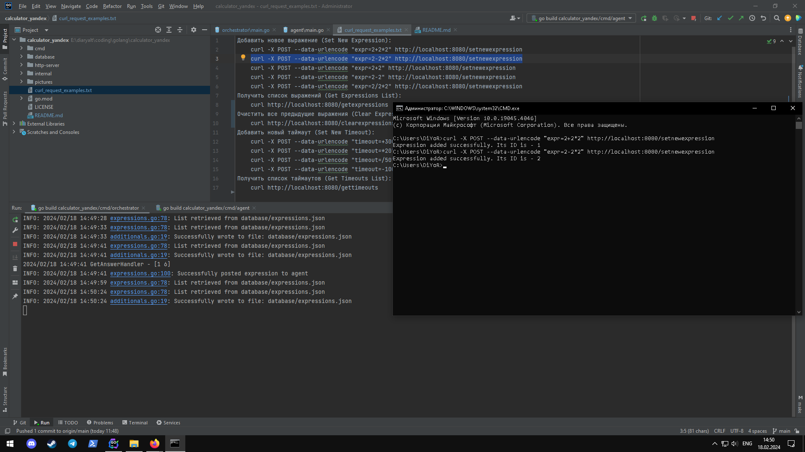
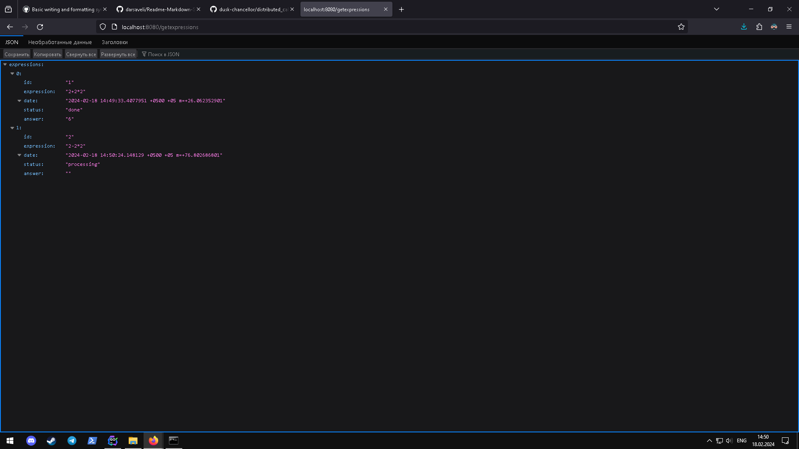
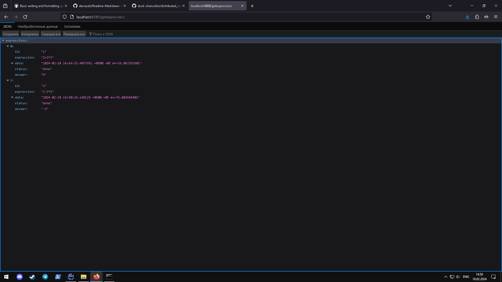
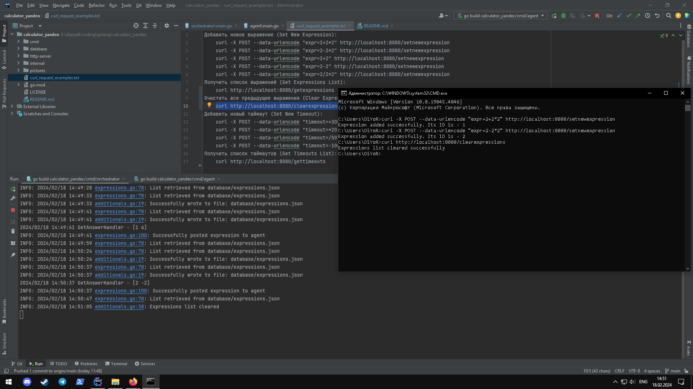
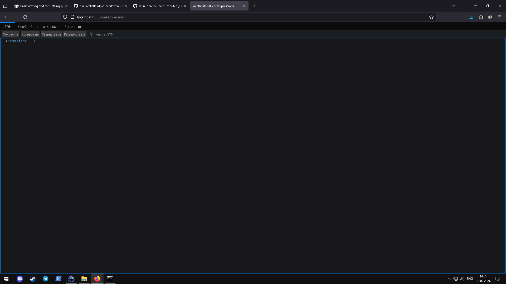

# Distributed Calculator (Primitive)

## [Схема работы проекта](pictures/primitive.png)

## [Примеры cURL запросов](curl_request_examples.txt)

## Как запускается и работает?
* Скачайте файлы с репозитория и поместите в нужную директорию </br>
* Откройте IDE и запустите проект: </br> </br>
**Запуск оркестратора в cmd/orchestrator/main.go**
 </br> </br>
**Запуск агента в cmd/agent/main.go**
 </br> </br>
* Откройте командную строку для запросов cURL и [примеры работы с cURL](curl_request_examples.txt) </br> </br>
**Открытие файла [curl_request_examples.txt](curl_request_examples.txt) и cmd в Windows**
 </br> </br>
* Совершите POST запрос на сервер:
```
curl -X POST --data-urlencode "expr=ваше_выражение" http://localhost:8080/setnewexpression
```
*В ячейке "expr=" введите свое выражение* </br> </br>
**Отправка выражения**

* Проверьте состояние выражения на данный момент </br> </br>
**Зайдите в [http://localhost:8080/getexpressions](http://localhost:8080/getexpressions)**
 </br> </br>
**Обновите**
 </br> </br>
* Как видите, операция прошла успешно. Давайте продолжим: </br> </br>
**Отправка нового выражения**
 </br> </br>
**Заходим в [http://localhost:8080/getexpressions](http://localhost:8080/getexpressions)**
 </br> </br>
**Обновляем**
 </br> </br>
* И эта операция завершилась успешно. Теперь очистим сессию:
```
curl http://localhost:8080/clearexpressions
```
**Очищаем [http://localhost:8080/getexpressions](http://localhost:8080/getexpressions)**
 </br> </br>
**Проверяем [http://localhost:8080/getexpressions](http://localhost:8080/getexpressions)**

* Сессия завершена. Приложение работает 😊

### Критерии и соответствия
0. - [x] Необходимые требования:
    - [x] Существует Readme документ, в котором описано, как запустить систему и как ей пользоваться.
        -   Это может быть docker-compose, makefile, подробная инструкция - на ваш вкус
    - [x] Если вы предоставляете только http-api, то
        - в Readme описаны примеры запросов с помощью curl-a или любым дргуми понятными образом
        - примеры полны и понятно как их запустить
          Этот пункт дает 10 баллов. Без наличия такого файла - решение не проверяется. </br>
*Реализовано*
1. - [x] Программа запускается и все примеры с вычислением арифметических выражений корректно работают - 10 баллов </br>
*Реализовано*
2. - [ ] Программа запускается и выполняются произвольные примеры с вычислением арифметических выражений - 10 баллов </br>
*Вердикт проверяющего*
3. - [x] Можно перезапустить любой компонент системы и система корректно обработает перезапуск (результаты сохранены, система продолжает работать) - 10 баллов </br>
*Реализовано*
4. - [ ] Система предосталяет графический интерфейс для вычисления арифметических выражений - 10 баллов </br>
*Не реализовано*
5. - [ ] Реализован мониторинг воркеров - 20 баллов </br>
*Не реализовано*
6. - [ ] Реализован интерфейс для мориторинга воркеров - 10 баллов </br>
*Не реализовано*
7. - [ ] Вам понятна кодовая база и структура проекта - 10 баллов (это субъективный критерий, но чем проще ваше решение - тем лучше).
     Проверяющий в этом пункте честно отвечает на вопрос: "Смогу я сделать пулл-реквест в проект без нервного срыва" </br>
*Вердикт проверяющего*
8. - [x] У системы есть документация со схемами, которая наглядно отвечает на вопрос: "Как это все работает" - 10 баллов </br>
*Реализовано*
9. - [ ] Выражение должно иметь возможность выполняться разными агентами - 10 баллов </br>
*Не реализовано*

- ***Итог - минимальный балл: 40, максимальный балл: 60***

## Контакты
*Если у вас возникли какие-нибудь вопросы/неполадки или же есть критика/советы/предложения, обращайтесь к [Диёру](https://t.me/duskchancellor)*
